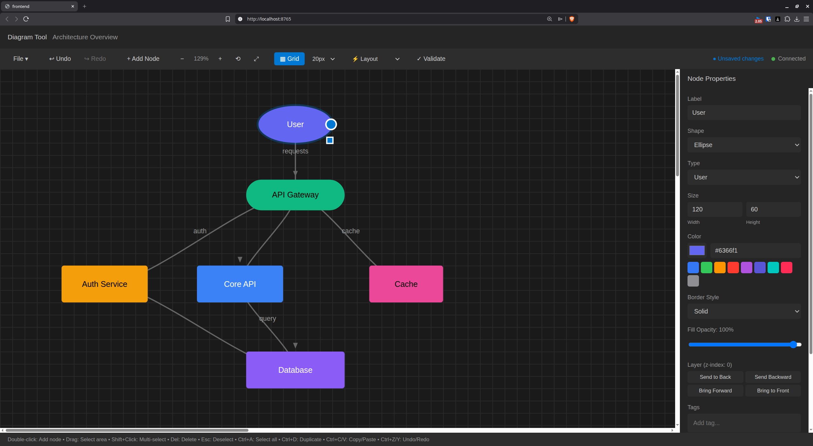

# Diagram Tool

A Figma-like tool for creating flowcharts and system diagrams. Single-user, local-first with JSON file storage.



## Features

- **Visual Diagram Editor**: Create and edit nodes and edges on an infinite canvas
- **Multiple Node Shapes**: Rectangle, ellipse, diamond, pill
- **Node Properties**: Label, color, type, tags, description
- **Edge Connections**: Click and drag to connect nodes
- **File Operations**: New, Open, Save, Save As with JSON format
- **Undo/Redo**: Full history support with Ctrl+Z / Ctrl+Y
- **Real-time Updates**: WebSocket sync for AI integration via MCP

## Architecture

```
┌─────────────────┐     HTTP/WS      ┌─────────────────┐
│    Frontend     │◄────────────────►│    Backend      │
│  React + TS     │                  │    FastAPI      │
│  localhost:5173 │                  │  localhost:8765 │
└─────────────────┘                  └────────┬────────┘
                                              │
                                     ┌────────▼────────┐
                                     │   JSON Files    │
                                     │  (diagrams/*.json)
                                     └─────────────────┘
```

## Quick Start

```bash
# Start both backend and frontend
./start.sh

# Or start separately:
./start-backend.sh   # Terminal 1
./start-frontend.sh  # Terminal 2
```

Then open http://localhost:5173 in your browser.

## Keyboard Shortcuts

| Shortcut | Action |
|----------|--------|
| Ctrl+N | New diagram |
| Ctrl+O | Open diagram |
| Ctrl+S | Save |
| Ctrl+Shift+S | Save As |
| Ctrl+Z | Undo |
| Ctrl+Y / Ctrl+Shift+Z | Redo |
| Delete | Delete selected node/edge |
| Escape | Cancel connection |
| Double-click | Add new node |

## Diagram JSON Format

```json
{
  "id": "diagram-uuid",
  "name": "My Diagram",
  "nodes": [
    {
      "id": "n1",
      "label": "Service A",
      "type": "component",
      "shape": "rectangle",
      "color": "#3478f6",
      "x": 100,
      "y": 100,
      "width": 150,
      "height": 80,
      "tags": ["backend"],
      "description": "Main service"
    }
  ],
  "edges": [
    {
      "id": "e1",
      "from": "n1",
      "to": "n2",
      "label": "API call"
    }
  ],
  "metadata": {
    "created_at": "2024-01-01T00:00:00",
    "updated_at": "2024-01-01T00:00:00"
  }
}
```

## API Endpoints

### Diagram
- `GET /api/diagram` - Get current diagram state
- `PATCH /api/diagram` - Update diagram name
- `POST /api/diagram/new` - Create new diagram
- `POST /api/diagram/open` - Open diagram from file
- `POST /api/diagram/save` - Save diagram to file

### Nodes
- `POST /api/nodes` - Create node
- `GET /api/nodes/{id}` - Get node
- `PATCH /api/nodes/{id}` - Update node
- `DELETE /api/nodes/{id}` - Delete node

### Edges
- `POST /api/edges` - Create edge
- `GET /api/edges/{id}` - Get edge
- `PATCH /api/edges/{id}` - Update edge
- `DELETE /api/edges/{id}` - Delete edge

### Undo/Redo
- `POST /api/undo` - Undo last action
- `POST /api/redo` - Redo last undone action

### WebSocket
- `ws://localhost:8765/ws` - Real-time updates

## MCP Integration

The backend can be integrated with MCP (Model Context Protocol) servers, allowing AI agents to create and modify diagrams. The AI's edits flow through the same API and are broadcast via WebSocket to the frontend for real-time display.

## Development

### Backend
```bash
cd backend
python -m venv venv
source venv/bin/activate
pip install -r requirements.txt
python main.py
```

### Frontend
```bash
cd frontend
npm install
npm run dev
```

## Tech Stack

- **Backend**: Python 3.11+, FastAPI, Pydantic, WebSockets
- **Frontend**: React 18, TypeScript, Vite
- **Storage**: JSON files (local filesystem)
